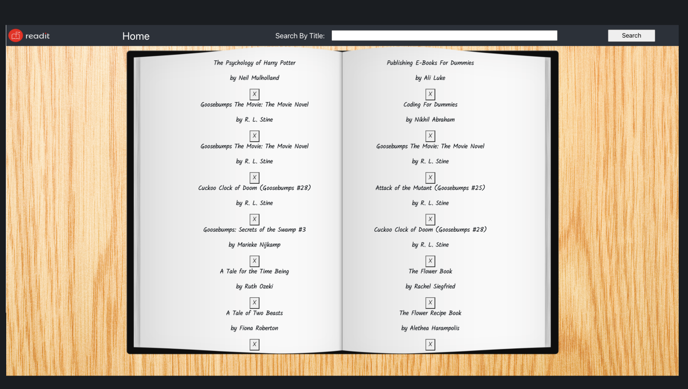
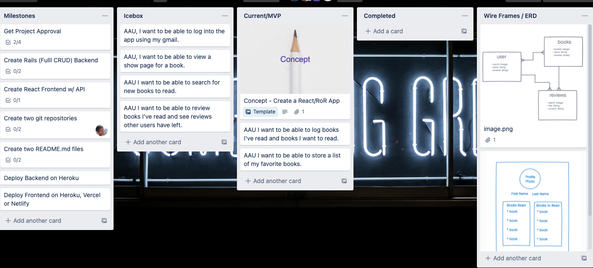
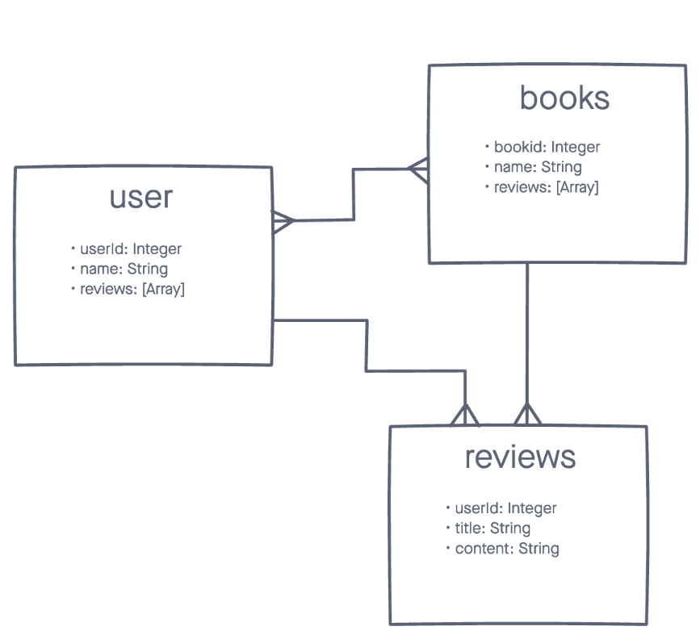
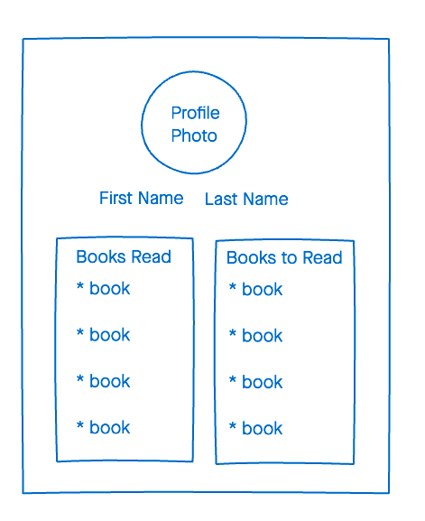

# Readit 📚 

This is a book project "Readit" where users can search for books that they want to read using the API. They can add books to their "Want to read" list, "Have read" list, or "Currently reading" list. Users will also be able to create reviews for books.
___
## How To Use This App: 
### Click <a href='https://we-read-it.herokuapp.com/'>here</a> to open with Heroku
___

## Technologies Used ⚙️:
- JavaScript
- GitHub
- REACT
- HTML
- CSS
- Trello
- Invisionapp
- Heroku
- Ruby
- Rails
___

## Developers 👩🏾‍💻👨🏽‍💻:
- ### <a href='https://www.linkedin.com/in/aigulsharipova/'>Aigul Sharipova</a>
- ### <a href='https://github.com/osully1'>Owen Sullivan</a>
- ### <a href='https://www.linkedin.com/in/patrick--long/'>Patrick Long</a>
- ### <a href='https://www.linkedin.com/in/tasha-l-egbuna/'>Tasha L. Egbuna</a>

## Screenshots 📸

